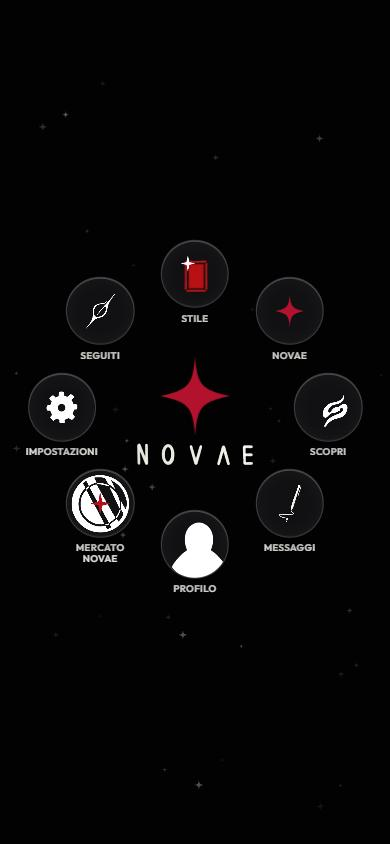
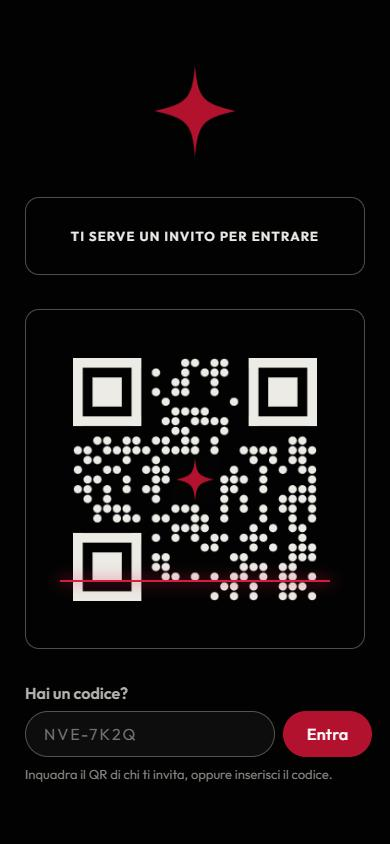
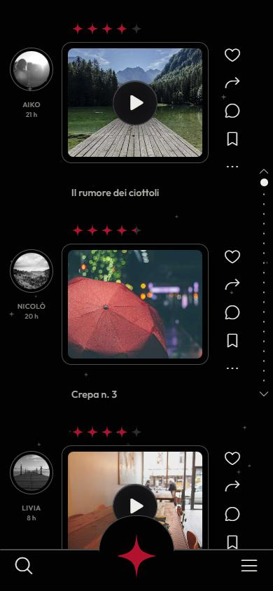
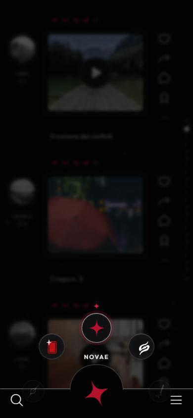
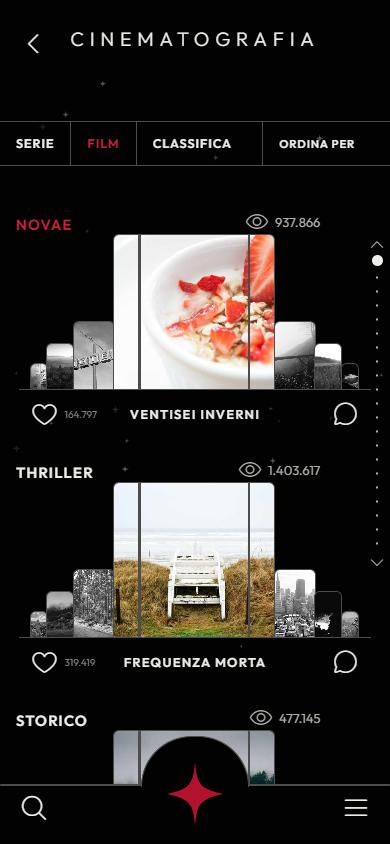
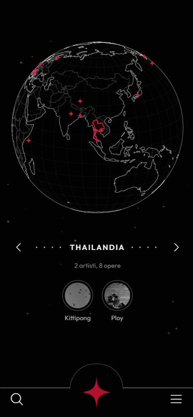
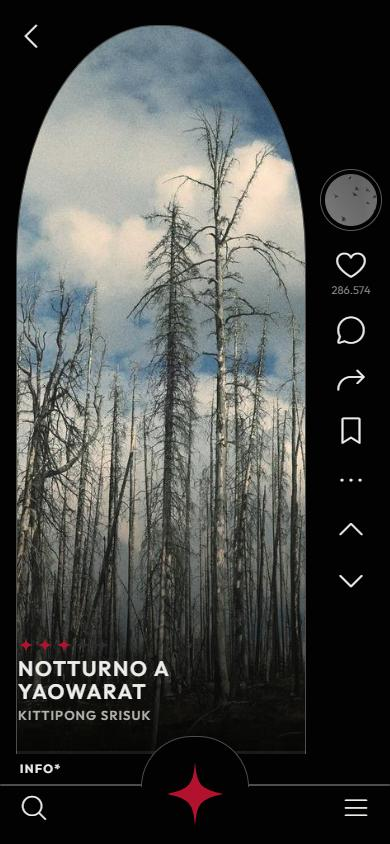

<div align="center">



# NOVAE

**Il social su invito dove gli artisti condividono le loro opere.**

### [Apri il sito → xandre04.github.io/novae](https://xandre04.github.io/novae/)


</div>

---

NOVAE è un social pensato per chi crea: registi, pittori, fotografi, musicisti, illustratori, scultori e poeti. Ogni artista pubblica le sue opere, le altre persone le guardano, le valutano con le stelle, le commentano e seguono chi le ha fatte.

Si entra **solo su invito**: serve il codice (o il QR) di qualcuno che è già dentro.

> [!NOTE]
> Questa è una **super alpha**: un prototipo navigabile per provare l'esperienza. Non c'è ancora un server: artisti e opere sono di esempio, le immagini sono foto segnaposto e quello che fai (mi piace, salvataggi, opere pubblicate) resta solo nel tuo browser.

## Come provarlo

1. Apri **[xandre04.github.io/novae](https://xandre04.github.io/novae/)**, meglio dal telefono.
2. Nella schermata d'invito scrivi un codice qualsiasi di almeno 4 caratteri (ad esempio `NVE-7K2Q`) e tocca **Entra**.
3. Dal menu a stella scegli dove andare, oppure usa la stella in basso per aprire la ruota delle sezioni.

## Schermate

| Invito | Menu principale | Feed Novae |
|:---:|:---:|:---:|
|  |  |  |
| **Ruota delle sezioni** | **Cinematografia** | **Scopri** |
|  |  |  |

<p align="center"><br><sub>Opera a schermo intero</sub></p>

## Cosa c'è dentro

**Sezioni**

- **Invito**: si entra con un codice o un QR.
- **Menu principale**: le 8 sezioni attorno alla stella NOVAE.
- **Novae**: il feed delle opere, con valutazione a stelle, mi piace, commenti, condivisione e salvataggi.
- **Opera**: vista a schermo intero e scheda completa con descrizione e opere correlate.
- **Stile → Cinematografia**: serie, film e classifica, con le righe a gradini per genere (Novae, Thriller, Storico).
- **Scopri**: un globo da girare con gli artisti di ogni paese.
- **Seguiti**: le opere degli artisti che segui, filtrabili per artista.
- **Mercato**: opere in vendita, con prezzi in crediti.
- **Profilo, Messaggi, Impostazioni**.

**Cose che puoi fare**

- **Pubblicare un'opera** dal profilo: immagine, titolo, disciplina e descrizione. Puoi anche eliminarla.
- **Salvare** un'opera col segnalibro e ritrovarla in *Profilo → Salvate*.
- **Seguire** gli artisti e scrivere loro nei messaggi.
- **Modificare il profilo**: nome, nome utente e bio.

**Scorciatoie**

| Gesto o tasto | Cosa fa |
|---|---|
| Doppio tocco su un'opera | Mi piace |
| Trascinare la ruota della stella | Scegliere la sezione (anche con rotellina o frecce ← →) |
| Swipe su e giù nella vista a schermo intero | Opera precedente o successiva (anche rotellina o frecce ↑ ↓) |
| Trascinare giù il feed dall'alto | Aggiornare il feed |
| `/` | Cercare opere e artisti |
| `Esc` | Chiudere pannelli, ricerca e ruota |
| Frecce ← → in Scopri | Cambiare paese |

## Design

Il linguaggio visivo nasce da bozzetti disegnati a mano: nero profondo, linee sottili grigie, una sola stella cremisi a quattro punte come accento. Le icone del sito sono ritagliate direttamente dai disegni originali in [`assets/icone/`](assets/icone/). I bozzetti delle schermate sono in [`docs/bozzetti/`](docs/bozzetti/).

## Avviarlo sul tuo computer

Non serve installare niente: sono file statici. Dalla cartella del progetto:

```bash
python -m http.server 5173
```

Poi apri http://localhost:5173.

## Struttura del progetto

```
novae/
├── index.html          le schermate (una sola pagina)
├── styles.css          lo stile
├── app.js              dati di esempio, navigazione e interazioni
├── assets/
│   └── icone/          icone disegnate a mano, usate dal sito
└── docs/
    ├── bozzetti/       i disegni originali delle schermate
    └── screenshots/    le immagini di questo README
```

Librerie usate, caricate da CDN: [Phosphor Icons](https://phosphoricons.com/) per le icone, [D3](https://d3js.org/) e [world-atlas](https://github.com/topojson/world-atlas) per il globo, font [Outfit](https://fonts.google.com/specimen/Outfit). Le foto segnaposto arrivano da [Picsum](https://picsum.photos/).

## Pubblicazione

Il sito è ospitato su **GitHub Pages** dal ramo `main`: ogni push aggiorna [xandre04.github.io/novae](https://xandre04.github.io/novae/) in circa un minuto.
